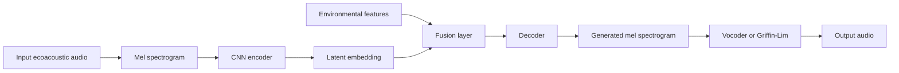
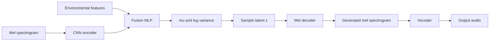
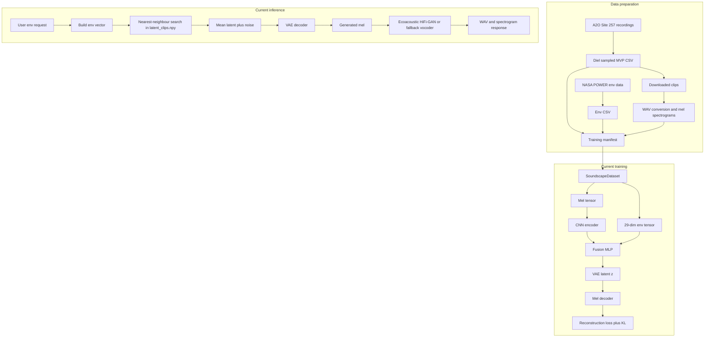
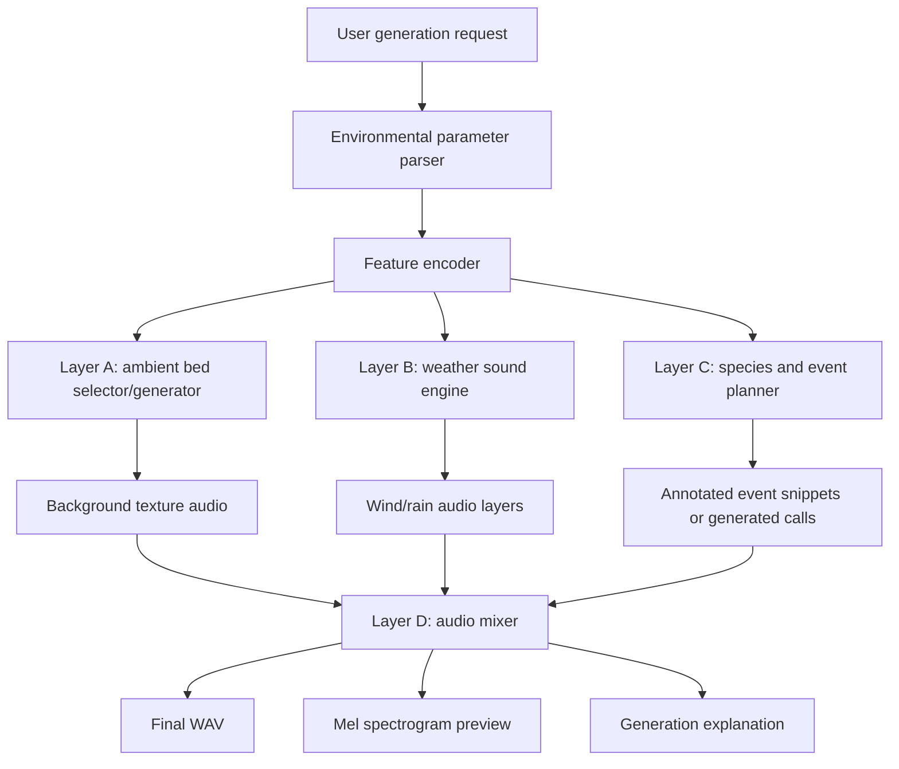
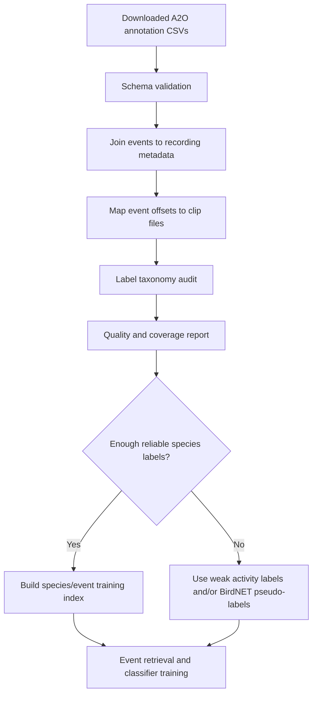
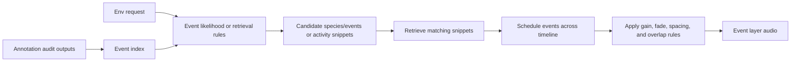
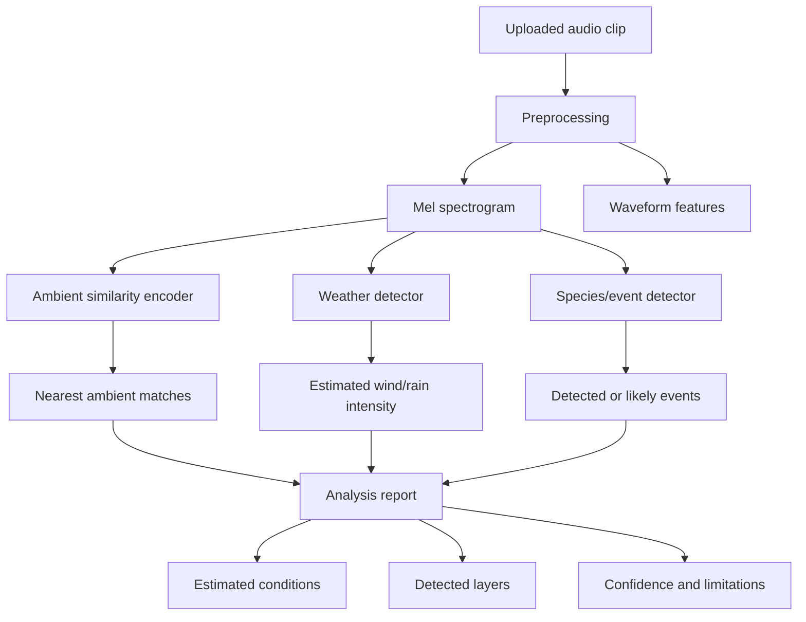
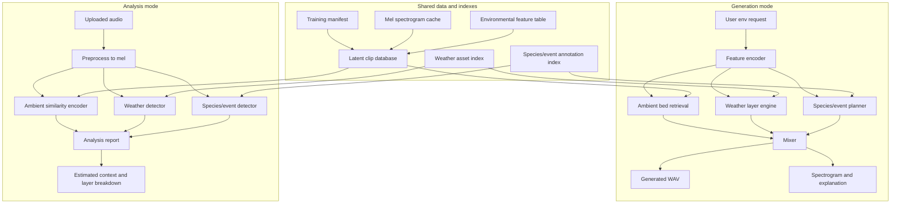

# AI MVP Decision Log and Revised Module Architecture

This document records the AI module path taken so far and proposes a revised MVP architecture for the generation and analysis modes.

---

## 1. Logging: Past Work, Roadmap, Decisions, Results, and Analysis

### Project Target

The project is a research-oriented prototype for speculative ecoacoustic soundscape generation. The core goal is not to reproduce one exact real recording from environmental data, but to generate plausible soundscapes under altered environmental conditions.

Current MVP focus:

- Prioritise the AI module over frontend/backend polish.
- Use the existing React/Vite frontend and Express backend as integration shells.
- Build an AI path that can produce believable audio and explainable outputs for demo and research evaluation.

### Current System State

| Area | Current State | Notes |
|---|---|---|
| Frontend | Basic React/Vite UI exists | Generation and transformation pages are scaffolded. |
| Backend | Express API exists | Auth endpoints and AI proxy routes exist. Auth is temporarily disabled in `requireAuth`. |
| AI server | FastAPI server exists | `acoustic_ai/server.py` exposes `/health`, `/analysis`, and `/generation`. |
| Dataset | Site 257 Bowra Dry-A MVP sample exists | 287 recordings, 6,148 usable clips, environmental data aligned. |
| Model checkpoint | VAE checkpoint exists | `acoustic_ai/checkpoints/best.pt`. |
| Latent database | Per-clip latent DB exists | `acoustic_ai/latent_clips.npy`. |
| Vocoder | Ecoacoustic HiFi-GAN checkpoint exists | `acoustic_ai/vocoder_checkpoints/best.pt`. |

### Dataset and Preprocessing Roadmap

| Step | Decision | Result | Analysis |
|---|---|---|---|
| Use Site 257 Bowra Dry-A | Start with one known ecoacoustic site instead of many sites | Reduced scope and improved consistency | Good MVP decision. A single site limits domain variation and makes evaluation easier. |
| Use diel stratified sampling | Sample across dawn, morning, afternoon, and night | 287 recordings across 73 local dates | Preserves time-of-day variation, which is one of the strongest ecoacoustic drivers. |
| Use clips instead of full FLAC files | Download shorter webm clips for training | 6,148 clips available | More practical for training. Original long files are not needed for MVP. |
| Align environmental data per recording | Fetch NASA POWER hourly/daily variables | `site_257_env_data.csv` aligned to 287 recordings | Useful conditioning data, but coarse and indirect for many acoustic effects. |
| Build training manifest | Join clip paths with environmental data | `site_257_training_manifest.csv` with 6,148 rows | Critical for reproducible training. |
| Convert/precompute audio | Convert webm to wav and precompute mel spectrograms | `.webm.wav` and `.npy` spectrogram paths used by dataset | Good for iteration speed, but naming is non-standard and should be documented. |
| Exclude unrecoverable clips | Do not retry 12 permanent A2O `422` failures | 12 missing clips excluded | Negligible impact: 12 out of 6,160 candidate clips. |

### Environmental Feature Design

Current model input uses 29 environmental features:

- 15 numeric features such as temperature, humidity, wind speed, precipitation, solar radiation, pressure, daily min/max temperature, days since rain, daylight hours, and local/UTC hour.
- 3 circular features encoded as sin/cos: wind direction, month, day of year.
- 2 categorical features encoded as one-hot: season and sample bin.

Important interpretation:

- Wind speed and rainfall are direct acoustic drivers because they can produce audible sound.
- Temperature, humidity, pressure, daylight, season, and days since rain are indirect ecological drivers.
- Indirect variables can influence species activity and vegetation state, but they do not map cleanly to a waveform by themselves.

### Model Roadmap So Far

#### Attempt 1: Plain Autoencoder

Original idea:



Decision:

- Use an autoencoder to learn a latent representation of environmental soundscape structure.
- Combine audio embedding with environmental variables.
- Decode latent representation back into a mel spectrogram.

Result:

- Reconstruction/generation quality did not meet expectations.
- Generated audio sounded like electronic machine noise rather than plausible ecoacoustic audio.

Analysis:

- A plain autoencoder learns to reconstruct training inputs, but it does not guarantee that averaged or sampled latent points decode to meaningful spectrograms.
- Mean latent templates can land in regions the decoder has never seen during training.
- Ecoacoustic audio often contains noise-like textures, silence, wind, insects, distant calls, and recording artefacts. MSE reconstruction can average these into blurred spectrograms.

#### Attempt 2: VAE Module

Updated idea:



Decision:

- Switch from a plain autoencoder to a VAE.
- Add KL regularisation so the latent space is smoother and more sampleable.
- Use a decoder with a larger temporal seed to avoid flat time-axis output.

Implementation details:

- `acoustic_ai/model.py` defines `SoundscapeModel`.
- CNN encoder maps mel spectrograms to a 512-dim audio embedding.
- Fusion MLP combines the audio embedding with 29 env features.
- VAE heads produce `mu` and `log_var`.
- Latent dimension is 256.
- Decoder outputs 128-bin mel spectrogram crops.
- Training objective is `MSE(reconstruction, input) + beta * KL`, with beta documented as 0.01.

Result:

- Better model structure than the plain autoencoder.
- Still did not produce believable ecoacoustic sound when used as a direct generator.
- Audio remained machine-like or noisy.

Analysis:

- The VAE improved the latent space but did not solve the main identifiability problem.
- Coarse environmental data cannot uniquely define a full ecoacoustic waveform.
- The model is asked to learn too many things at once: background ambience, wind, rain, species calls, recording conditions, microphone artefacts, and temporal event structure.
- MSE-style spectrogram reconstruction still encourages averaged, blurry outputs.
- Random or weakly grounded latent sampling remains risky.

#### Attempt 3: Nearest-Neighbour Latent Grounding and Ecoacoustic Vocoder

Updated generation path:


Decision:

- Stop relying on pure latent sampling.
- Use the per-clip latent database `latent_clips.npy`.
- Retrieve the top-k training clips whose environmental vectors are most similar to the requested conditions.
- Average their latent vectors and add controlled noise.
- Use an ecoacoustic HiFi-GAN trained on Site 257 audio instead of a speech-domain vocoder.

Result:

- More grounded than direct VAE sampling.
- The generated output is still limited by the decoder and latent representation.
- The vocoder path is more appropriate because it matches 128 mel bins and 22,050 Hz ecoacoustic audio.

Analysis:

- This is a better fallback strategy because generation starts near real training examples.
- However, it still tries to produce the whole soundscape through one latent vector.
- It does not explicitly separate background bed, weather sound, species events, and other annotated events.
- It has limited temporal/ecological narrative because a 30-second latent crop is static.

### Current AI Architecture Picture



### Main Lessons From Past Work

| Lesson | Implication for MVP |
|---|---|
| Full soundscape generation from coarse env data is underdetermined | Do not rely on one model to generate all acoustic content directly from weather variables. |
| Temperature and humidity are mostly indirect acoustic variables | Use them for event/species likelihood, not direct waveform generation. |
| Wind and rainfall are directly audible | Model or mix them as separate controllable layers. |
| Species calls and annotations have clearer ecological links | Treat annotated events as a separate event layer. |
| VAE latent sampling is risky for audio quality | Prefer retrieval, latent grounding, or asset-based mixing for MVP. |
| Vocoder domain matters | Ecoacoustic vocoder is better than speech-domain HiFi-GAN for this project. |
| A single generated spectrogram hides too many factors | Layered generation gives better control, explanation, and evaluation. |

---

## 2. New Approach: Generation Mode and Analysis Mode

### New MVP Principle

The revised MVP should treat a soundscape as layered acoustic composition rather than one monolithic generated waveform.

Proposed soundscape equation:

```text
speculative soundscape
= ambient site bed
+ weather layer
+ biological/event layer
+ final mix and explanation
```

This better matches the real causal structure:

- Ambient bed captures general site texture.
- Wind and rain are directly controlled by weather values.
- Species and annotated events are controlled by season, time, temperature, humidity, rainfall history, and labels.
- The final mixer produces the user-facing audio.

### Generation Mode: Revised Architecture



### Generation Layer A: Ambient Site Bed

Purpose:

- Provide the continuous ecoacoustic background texture.
- Capture general site tone, insects, low-level ambience, microphone characteristics, distant environmental noise, and non-specific acoustic texture.

Recommended MVP implementation:

- Use retrieval first, but **not over the raw downloaded clips** — those contain bird calls, vehicles, helicopters, and other events that belong in Layer C. Retrieving full clips as the bed double-counts events and breaks layer separation.
- Build a **cleaned ambient-only segment pool** as a precompute step. Cleaning is **audio-only and content-agnostic**, driven by two facts:
  - A2O annotations are sparse and asymmetric (presence ⇒ event, absence ⇏ no event), so they cannot serve as a gating signal.
  - Events are an open class. We can never enumerate every category (species, helicopters, vehicles, frogs, voices, unknown). But every event shares one property: it deviates from its own clip's stationary baseline.
- The gate is therefore a **per-clip anomaly detector**: compute frame features (mel, RMS, centroid, flatness, flux, ZCR), maintain a 30 s rolling median + MAD baseline, mark frames where any feature deviates > 3·MAD as anomalous, dilate ± 0.5 s, then keep contiguous unmasked spans ≥ 20 s and slice them into segments of 20–60 s (target 30 s). Long segments mean runtime crossfades are at most ~1 s and inaudible.
- A neural species detector (BirdNET) is deliberately **not** in the gate — it only knows species in its training set and is deaf to other event types, which is the wrong failure mode for a permissive gate. BirdNET and annotations are demoted to post-hoc audits over retained segments, used to tune the MAD threshold rather than to filter.
- At runtime, retrieve from this cleaned pool with a two-step rule. **Hard filter** on `diel_bin` and `season` — categorical mismatches sound wrong regardless of numeric proximity. **Soft rank** by cosine similarity on `[hour_sin, hour_cos, month_sin, month_cos]` only: time-of-day and seasonal *position* within the bin. Top-k=5, softmax-weighted crossfade blend.
- Temp/humidity/wind/rain are deliberately **excluded** from the Layer A retrieval key. Wind and rain are direct acoustic signals owned by Layer B. Temperature and humidity affect species/insect behaviour and so flow through Layer C. The ambient bed itself is driven by time and season; pulling weather variables into the key would either double-count (with B) or pull in similarity that is irrelevant to ambient character (with C).
- VAE reconstruction is **not** on the Layer A path. The existing VAE was trained on event-contaminated full clips, so its latent manifold is not "ambient-only". Keep it for transformation mode and Module E analysis.

Why:

- Layered separation only works if Layer A actually contains *only* ambience. Anything else makes Layer C double-count and makes the explanation JSON dishonest.
- Retrieval over cleaned segments + crossfade has zero lossy steps (no decoder, no vocoder), so audio quality is bounded by the source recordings rather than by the model.
- Selection remains research-valid and explainable: each retrieved segment carries its source clip ID, env vector, and similarity score.

Comparison:

| Approach | How it works | Pros | Cons | MVP fit |
|---|---|---|---|---|
| Raw audio retrieval | Pick one or more real clips similar to requested env conditions | Highest realism, fast, explainable | Less novel generation; limited to dataset examples | Strong |
| Latent nearest-neighbour plus VAE decode | Retrieve similar latent vectors, decode through VAE | Uses existing model, more generative | Still risks machine-noise output | Medium |
| VAE random sampling | Sample latent and decode | Simple once trained | Poor quality and weak control observed | Weak |
| Diffusion background generator | Train conditional diffusion for ambience | Best long-term generative direction | Too expensive and risky for MVP | Future |

MVP recommendation:

```text
Use raw/latent retrieval for ambient bed.
Keep VAE as representation and transformation support, not the only renderer.
```

### Generation Layer B: Weather Sound Engine

Purpose:

- Generate or mix direct weather sounds: wind and rain.
- Map user parameters to audible intensity, texture, and volume.

Inputs:

- `wind_speed_ms`
- `wind_direction_deg`
- `wind_max_ms`
- `precipitation_mm`
- `precipitation_daily_mm`
- `days_since_rain`
- optional: `humidity_pct`, `sample_bin`, `season`

Recommended MVP implementation:

- Build a small library of real wind and rain clips from the dataset.
- Tag or bucket them by intensity.
- Mix them over the ambient bed with parameter-controlled gain, filtering, and density.

Comparison:

| Approach | How it works | Pros | Cons | MVP fit |
|---|---|---|---|---|
| Rule-based asset mixing | Select wind/rain assets by intensity and mix them | Very controllable, good audio quality, easy to explain | Requires curated assets | Strong |
| Classifier plus retrieval | Detect wind/rain intensity in existing clips, retrieve matching layers | More data-driven | Needs labels or heuristics | Strong after curation |
| Procedural synthesis | Generate wind/rain from noise filters and envelopes | No dataset dependency, parameter-controllable | May sound artificial if not tuned | Medium |
| Neural weather generator | Train model for rain/wind conditioned on values | More advanced | Needs labelled/intensity-specific data | Future |

MVP recommendation:

```text
Use curated real weather assets plus simple parameter-controlled mixing.
```

Example mapping:

| Parameter condition | Weather layer behaviour |
|---|---|
| `wind_speed_ms < 2` | No wind layer or very low gain. |
| `2 <= wind_speed_ms < 6` | Light wind bed, high-pass filtered less aggressively. |
| `wind_speed_ms >= 6` | Stronger wind layer, more low-mid energy and amplitude movement. |
| `precipitation_mm == 0` | No rain layer. |
| `0 < precipitation_mm < 2` | Sparse light rain layer. |
| `precipitation_mm >= 2` | Dense rain layer with higher gain and broader spectrum. |

### Generation Layer C: Species and Annotated Event Layer

Purpose:

- Add recognisable biological or annotated acoustic events.
- Make environmental variables meaningful through ecological likelihood, not direct waveform control.
- Treat annotation data as a preprocessing dependency: the final event-layer design cannot be fixed until the annotation files are audited and converted into a usable event index.

Pre-training requirement: annotation audit and preprocessing

Before training any species/event model, the project needs a dedicated annotation analysis step. The current A2O annotation CSVs contain mixed event types and mixed label quality, so the first task is to identify what labels are actually available and how reliable they are.

Current annotation schema includes:

| Field group | Example columns | Why it matters |
|---|---|---|
| Recording identity | `audio_recording_id`, recording start date/time, site fields | Joins each event back to clips, env data, and source audio. |
| Event timing | `event_start_seconds`, `event_end_seconds`, `event_duration_seconds` | Required to extract event snippets and align events to 300 s clips. |
| Frequency region | `low_frequency_hertz`, `high_frequency_hertz` | Useful for filtering, event-type grouping, and spectrogram cropping. |
| Confidence/activity | `score`, `is_reference` | Can support thresholding and weak activity labels. |
| Biological labels | `common_name_tags`, `species_name_tags` | Candidate supervised labels for species/event layer. |
| Other labels | `other_tags` | May contain non-species acoustic classes or useful metadata. |
| Verification | `verification_*`, `verification_consensus` | Determines whether labels should be trusted as ground truth or weak labels. |
| Import/source | `audio_event_import_file_name`, `audio_event_import_name` | Helps distinguish BirdNET imports, manual annotations, and other sources. |

Known data issue from the current audit notes:

| Observation | Impact |
|---|---|
| 287 annotation files exist, but only a subset contains event rows | Annotation availability is sparse at recording level. |
| 2,739 event rows were previously reported across 22 recordings | Species/event training data is much smaller than the audio dataset. |
| Many events are score-only with no common/species name | These are useful as weak `bioacoustic_activity` labels, but not species labels. |
| Species-labelled events are imbalanced | A classifier trained directly on raw labels may overfit dominant species/classes. |
| Some labels appear to come from BirdNET imports | Label source and confidence threshold must be tracked. |

Annotation preprocessing workflow:



Required preprocessing outputs:

| Output | Description | Used by |
|---|---|---|
| `annotation_event_index.csv` | One row per usable event with recording ID, clip path, event start/end, label, score, source, verification status, and env features | Event retrieval, event scheduling, classifier training |
| `annotation_label_report.md` | Counts by label, source, confidence band, season, sample bin, and recording | Decision making before model design |
| `event_snippet_manifest.csv` | Extractable audio snippets for labelled or weak-labelled events | Species/event layer assets |
| `activity_label_manifest.csv` | Binary activity/no-activity or event-present labels when species names are missing | Weak activity detector |

Decision gates after preprocessing:

| Audit result | Recommended Layer C design |
|---|---|
| Many reliable species labels across enough recordings | Train a small species/event classifier or event likelihood model. |
| Few species labels but many high-confidence BirdNET events | Use BirdNET pseudo-label retrieval with confidence thresholds. |
| Mostly score-only events | Use a binary activity layer and avoid species-specific claims. |
| Labels are highly imbalanced | Use retrieval and rule-based scheduling; avoid supervised multiclass training for MVP. |
| Event timing is reliable but labels are weak | Use event snippets as generic biological activity textures. |

Inputs:

- `season`
- `sample_bin`
- `hour_local`
- `month`
- `day_of_year`
- `temperature_c`
- `humidity_pct`
- `precipitation_mm`
- `days_since_rain`
- audited annotation labels, weak activity labels, or BirdNET pseudo-labels

Recommended MVP implementation:

- First run the annotation audit/preprocessing step.
- Use annotated clips only where labels, timing, and confidence are good enough.
- Add BirdNET pseudo-labels if species coverage is too sparse.
- Train or implement an event likelihood model only after label coverage is known.
- Retrieve real event snippets and place them into the mix with simple scheduling rules.

Comparison:

| Approach | How it works | Pros | Cons | MVP fit |
|---|---|---|---|---|
| Annotation audit/index first | Analyse CSV labels, sources, confidence, timing, and coverage before training | Prevents designing the wrong classifier; clarifies what labels are usable | Adds a preprocessing step | Required |
| Annotation retrieval | Select real labelled snippets matching env/time | Realistic and explainable | Existing labels are sparse | Strong if audit confirms enough examples |
| BirdNET pseudo-label retrieval | Run BirdNET, use high-confidence species labels | Expands label coverage | Pseudo-label errors need thresholding | Strong |
| Simple probabilistic event model | Estimate event likelihood by season/time/env buckets | Easy to build and explain | Coarse, not deep learning | Strong |
| MLP classifier on VAE latent | Predict species/event presence from latent z | Uses learned representation | Needs enough labels | Medium |
| Generative species-call model | Generate calls from scratch | More novel | High risk and data-hungry | Future |

MVP recommendation:

```text
Use event retrieval and scheduling, not from-scratch species-call generation.
Do annotation preprocessing before deciding whether Layer C is species-specific,
generic biological activity, BirdNET-assisted, or retrieval-only.
```

Example event planning:



### Generation Layer D: Mixer and Output Explanation

Purpose:

- Combine layers into one coherent audio file.
- Produce a spectrogram and an explanation so the user understands why the output sounds the way it does.

Mixer responsibilities:

- Match sample rate.
- Trim or loop layers to requested duration.
- Apply fades to avoid clicks.
- Control gain staging to avoid clipping.
- Optionally apply light EQ per layer.
- Export final WAV.
- Generate mel spectrogram preview.
- Return a JSON explanation of selected clips/events.

Example explanation fields:

| Field | Meaning |
|---|---|
| `ambient_source_clips` | Real clips used as the background bed. |
| `weather_layers` | Wind/rain assets and intensity mapping. |
| `event_layers` | Species/events selected and why. |
| `env_match_score` | Similarity between user request and retrieved source clips. |
| `limitations` | Notes about speculative nature and dataset gaps. |

### Generation Mode: MVP Build Order

| Priority | Component | Reason |
|---|---|---|
| 1 | Ambient retrieval bed | Highest immediate audio realism. |
| 2 | Mixer/export pipeline | Needed to combine all later layers. |
| 3 | Wind/rain asset layer | Directly maps env controls to audible change. |
| 4 | Annotation/BirdNET event index | Enables species/event layer. |
| 5 | Event planner and scheduler | Makes output ecologically explainable. |
| 6 | Optional VAE reconstruction/transformation | Use where it improves variation without hurting quality. |
| 7 | Future diffusion/generative modules | Later research extension. |

### Analysis Mode: Revised Architecture

Analysis mode should not only encode a clip into a latent vector. It should decompose and explain the clip using the same layered logic as generation.



### Analysis Component A: Ambient Similarity Encoder

Purpose:

- Locate the uploaded clip in the learned/retrieved soundscape space.
- Estimate broad context: season, diel bin, similar training recordings, and plausible environmental ranges.

Available current implementation:

- `encode_clip()` encodes an uploaded audio clip to latent `mu`.
- `estimate_env_conditions()` compares this latent with `latent_clips.npy`.
- It averages top-k neighbours to estimate environmental conditions.

Comparison:

| Approach | How it works | Pros | Cons | MVP fit |
|---|---|---|---|---|
| Current VAE latent nearest-neighbour | Encode clip, compare latent to training latents | Already implemented, explainable | Accuracy limited by VAE representation | Strong |
| Audio embedding model such as CLAP/YAMNet | Use pretrained audio embeddings | Strong general audio representation | May not be ecoacoustic/site-specific | Medium |
| Hand-crafted acoustic indices | Compute ACI, entropy, spectral centroid, band energy | Easy to explain scientifically | Less flexible, not learned | Medium |
| Custom contrastive encoder | Train retrieval embedding for ecoacoustic similarity | Good long-term | Needs careful training design | Future |

MVP recommendation:

```text
Keep VAE latent nearest-neighbour for broad context estimation.
Add simple acoustic indices as supporting evidence if time allows.
```

### Analysis Component B: Weather Detector

Purpose:

- Detect or estimate audible weather contribution in the uploaded clip.
- Separate direct acoustic weather from indirect environmental context.

Possible outputs:

- `wind_intensity`: none, light, moderate, strong.
- `rain_intensity`: none, light, moderate, heavy.
- confidence score.

Comparison:

| Approach | How it works | Pros | Cons | MVP fit |
|---|---|---|---|---|
| Rule-based spectral heuristics | Use broadband energy, low-frequency modulation, high-frequency rain texture | Fast, no labels needed | Approximate and brittle | Medium |
| Label curated clips manually | Manually tag wind/rain intensity buckets | Accurate for MVP dataset | Requires small manual effort | Strong |
| Train classifier on curated labels | CNN/MLP predicts wind/rain class | More scalable | Needs labelled examples | Medium after labels |
| Use external audio event model | Detect rain/wind from pretrained model | Quick if model works | Domain mismatch possible | Medium |

MVP recommendation:

```text
Start with small curated labels for wind/rain intensity.
Use these labels both for analysis detection and generation asset retrieval.
```

### Analysis Component C: Species and Event Detector

Purpose:

- Identify biologically meaningful events in an uploaded clip.
- Provide a better explanation than "this clip has these weather values."

Comparison:

| Approach | How it works | Pros | Cons | MVP fit |
|---|---|---|---|---|
| Existing A2O annotations | Use available annotation CSVs | Grounded in project data | Sparse: only a subset has useful species labels | Medium |
| BirdNET pseudo-labels | Run BirdNET over clips and uploaded audio | Strong for bird species, expands coverage | Confidence thresholding needed | Strong |
| Binary activity detector | Treat score-only annotations as activity events | Uses more existing annotation data | Does not identify species | Medium |
| MLP on frozen VAE latent | Predict event/species vector from latent | Fits A/B/C module plan | Needs enough labels or pseudo-labels | Future/MVP extension |

MVP recommendation:

```text
Use BirdNET or high-confidence pseudo-labels for species/event analysis.
Use existing annotations as validation or overrides where available.
```

### New Unified Architecture Picture



### Refined Module Names for MVP

| Module | Role | MVP implementation | Future upgrade |
|---|---|---|---|
| Module A: Ambient Representation | Encode/retrieve general site texture | VAE encoder plus nearest-neighbour retrieval | Contrastive ecoacoustic encoder or diffusion prior |
| Module B: Weather Layer | Add direct rain/wind sounds | Curated weather assets plus parameter mixing | Weather-specific neural generator |
| Module C: Event Layer | Add species/annotation events | Annotation/BirdNET retrieval plus scheduler | Frozen encoder plus species classifier/generator |
| Module D: Mixer | Combine and export final soundscape | Librosa/soundfile/pydub-style mixing | Differentiable mixer or DAW-like UI controls |
| Module E: Analysis Explainer | Explain uploaded/generated audio | Latent nearest-neighbour plus detectors | Full multi-label ecological analysis model |

### Key Research Framing

The revised MVP should be framed as a layered, environmentally conditioned speculative soundscape system.

This is stronger than claiming the model directly learns a one-to-one mapping from weather to audio.

Suggested wording:

```text
Environmental conditions influence soundscape composition through multiple mechanisms.
The MVP models these mechanisms separately: ambient site texture, direct weather acoustics,
and biologically meaningful event layers. The final soundscape is generated by selecting,
transforming, and mixing these layers according to the requested environmental scenario.
```

### Risks and Mitigations

| Risk | Impact | Mitigation |
|---|---|---|
| Retrieved audio sounds too close to training data | May appear less generative | Present MVP as retrieval-augmented speculative generation; add transformations and layer mixing. |
| Species labels are sparse | Weak event layer | Use BirdNET pseudo-labels with confidence thresholds. |
| Weather labels are missing | Hard to build wind/rain layer | Manually curate a small weather asset set first. |
| Layer mixing sounds artificial | Reduces demo quality | Use fades, gain normalisation, light EQ, and avoid over-layering. |
| Env-to-audio claims are too strong | Research criticism | Clearly separate direct acoustic variables from indirect ecological predictors. |
| VAE output remains poor | Affects generated bed if used directly | Use VAE mainly for embedding/retrieval and optional transformations, not primary audio rendering. |

### Recommended Immediate Next Steps

| Step | Output |
|---|---|
| 1. Build an ambient retrieval function | Given env settings, return top matching real clips and similarity scores. |
| 2. Build a mixer utility | Combine background, weather, and event layers into one WAV. |
| 3. Curate wind/rain asset folders | Small labelled library: no/light/moderate/strong. |
| 4. Add generation API v2 | Return final mixed audio plus explanation JSON. |
| 5. Add analysis layer report | For uploaded audio, return ambient match, weather estimate, event estimate, confidence. |
| 6. Add BirdNET or annotation index | Populate species/event layer for generation and analysis. |

### MVP Success Criteria

| Criterion | Target |
|---|---|
| Audio quality | Output sounds like plausible environmental audio, not electronic machine noise. |
| Control | Wind/rain/time/season changes produce audible and explainable differences. |
| Ecological plausibility | Species/events are plausible for the selected season/time/env context. |
| Explainability | API can report which clips/assets/events were selected and why. |
| Demo stability | Generation works reliably without depending on fragile latent random sampling. |
