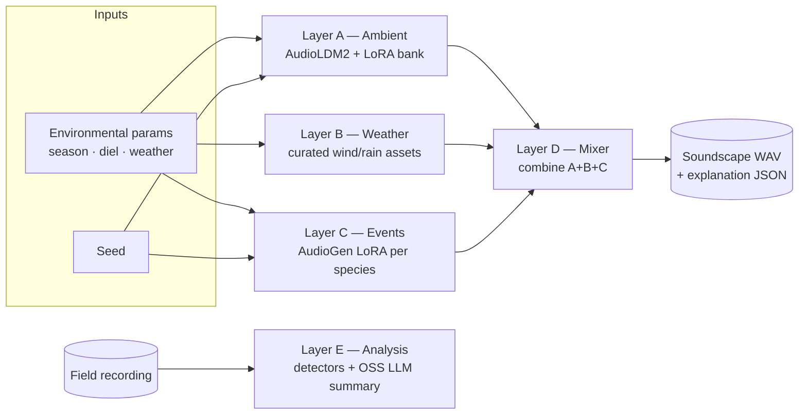
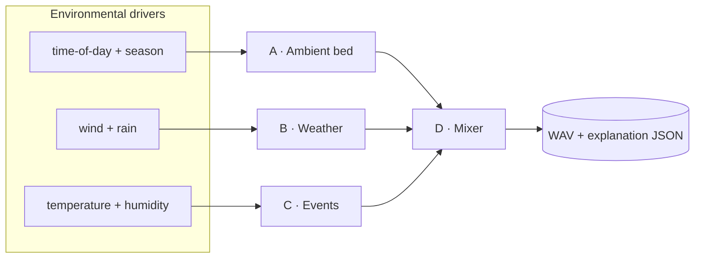
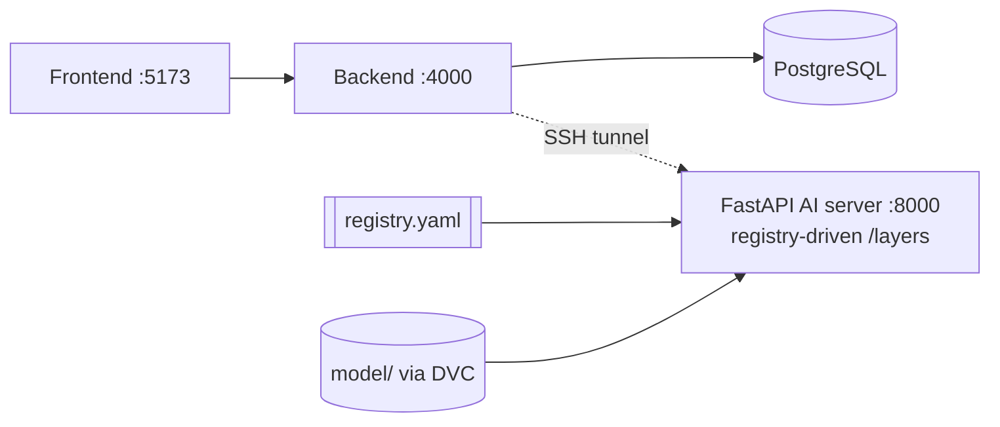

# Speculative Soundscape Generation

> **COMP-6000 Capstone 2** · The University of Adelaide
> Research prototype: ecoacoustic recordings + environmental data → AI-generated *speculative* soundscapes.

This project explores how ecoacoustic field recordings, paired with environmental
context (season, time of day, weather), can drive a generative AI system that
composes **speculative soundscapes** — plausible-but-synthetic acoustic
environments. Rather than generating a single end-to-end waveform, the system
models a soundscape as a **layered composition** (ambient bed + weather + events
+ mix), where each layer is learned and controllable independently. The goal is
not faithful reproduction but *speculation*: rendering how a site might sound
under conditions it was never recorded in.

> [!NOTE]
> This is an active university capstone prototype. Several layers are functional;
> others are deliberately placeholders. See [Project status](#project-status) for
> an honest snapshot of what is demonstrated today.

---

## Table of contents

1. [Research framing](#research-framing)
2. [Approach — the layered model](#approach--the-layered-model)
3. [Project status](#project-status)
4. [System architecture](#system-architecture)
5. [Repository layout](#repository-layout)
6. [Getting started](#getting-started)
7. [Backend API](#backend-api)
8. [Development & conventions](#development--conventions)
9. [Team & acknowledgements](#team--acknowledgements)
10. [License](#license)

---

## Research framing

### Motivation

Ecoacoustic monitoring captures long, continuous recordings of natural sites.
These archives describe how a place *did* sound. This project asks a speculative,
generative question instead: **how might a place sound under conditions it was
never recorded in** — a different season, a storm that never came, a species
heard out of its usual hour? Such speculative renderings have value for
ecological imagination, education, and the design of future/alternative
environments.

### Modes

The system is framed around the following modes:

| Mode | Question it answers | Status |
|------|---------------------|--------|
| **Analysis** | What is *in* this recording — ambient character, weather, events? | In scope; analysis is summarised with an **open-source LLM** layered on the detectors. |
| **Generation** | Produce a new soundscape from environmental parameters. | In scope — the core demonstrated capability. |
| **Transformation** | Re-render an existing recording under *new* environmental conditions. | **Out of scope** — planned to be disabled; not part of the deliverable. |

### Core principles

Two design commitments run through the whole project:

- **Authenticity over cleanliness.** Avoid aggressive filtering/denoising —
  anthropogenic and incidental noise is authentic soundscape data, not error.
- **Learned, not hand-crafted, representations.** Data is encoded
  (spectrogram → encoder → embedding) and learned, rather than reduced to
  hand-tuned parameters.

---

## Approach — the layered model

A soundscape is composed from independent, individually controllable layers
rather than a single generated signal. Each layer is its own model/strategy with
its own training attempts and checkpoints.



| Layer | Role | Model / strategy |
|-------|------|------------------|
| **A — Ambient** | Ambient bed | AudioLDM2 (`cvssp/audioldm2`) + per-cell LoRA bank |
| **B — Weather** | Wind / rain | Curated assets + parameter mixing |
| **C — Events** | Species calls | AudioGen (`facebook/audiogen-medium`, 16 kHz) + per-species LoRA |
| **D — Mixer** | Compose A+B+C | Combine layers → WAV + explanation JSON |
| **E — Analysis** | Inspect input | Detector heads + open-source LLM narrative |

The five layers share one stack but run in two **directions**: **Generation**
synthesises forward through A → B → C → D; **Analysis** runs the input
*backwards* through E, which reuses the same detectors and embeddings that the
generators are conditioned on.

### How the layers interact

The design's core idea is **strict separation of concerns** between layers, so the
environmental parameters route to whichever layer actually owns that acoustic
phenomenon — no double-counting:

- **Layer A (ambient bed)** is driven by **time-of-day + seasonal position only**
  (the `season × diel` cell), *not* weather. The bed is continuous site tone,
  insects, and low-level texture. It **must not contain events** — bird calls,
  vehicles, helicopters belong to Layer C; wind and rain belong to Layer B.
  Mixing events into the bed double-counts them and breaks layer separation.
- **Layer B (weather)** owns the **direct acoustic signals** of weather — wind and
  rain — selected and intensity-mixed from curated assets. This is why
  wind/rain are deliberately *excluded* from Layer A's retrieval key.
- **Layer C (events)** is driven by **temperature and humidity**, because those
  variables affect species/insect *behaviour* (when and how often they call)
  rather than producing sound directly. Each species is a per-species AudioGen
  LoRA; an event planner schedules calls over the timeline.
- **Layer D (mixer)** combines A + B + C into one coherent file: it matches sample
  rate (22,050 Hz), trims/loops layers to the requested duration, applies fades
  and gain staging to avoid clicks and clipping, exports the final WAV + mel
  spectrogram preview, and emits an **explanation JSON** (`ambient_source_clips`,
  `weather_layers`, `event_layers`, `env_match_score`, `limitations`) so every
  output is traceable back to its sources.
- **Layer E (analysis)** runs three **detector heads in parallel** on the raw
  input mixture — ambient context (k-NN against the learned latent index),
  weather intensity, and species/event onsets — then aggregates them into one
  report. It mirrors the generation conditioning, so analysis and generation
  speak the same representational language.



### Generative model strategy

Layers A and C use **frozen large base models + LoRA adapters** for the MVP,
rather than training audio generators from scratch. This keeps the prototype
tractable while remaining controllable per-context (e.g. Layer A ships a bank of
16 `season × diel` adapters; Layer C trains one LoRA per species). Migration to
in-house **distilled** models is a future option, gated on three conditions:
(1) the LoRA path proving out across species/contexts, (2) a demonstrated
latency/VRAM bottleneck, and (3) team capacity.

### Analysis strategy (Layer E + open-source LLM)

Layer E first runs its deterministic detector heads (ambient similarity, weather
intensity, event onsets) over the input, producing grounded, structured signal.
Those structured outputs are then handed to an **open-source LLM** (specific model
*not yet decided*) which writes the human-readable analysis. The detectors supply
the facts; the LLM supplies the synthesis and narrative.

The LLM renders that narrative in **two styles of language** — two distinct
registers of the same underlying analysis, so the result suits different readers.

> [!NOTE]
> The exact definition of the two language styles is owned by the team spec.
> Confirm the intended pair (e.g. a grounded/technical register vs. a
> speculative/lay register) and this section will be made precise.

### Sample results

Each attempt ships reference audio + spectrograms in three tiers, directly under
its folder (`acoustic_ai/layers/<layer>/attempts/<id>/`):

| Tier | What it is | Tracking |
|------|------------|----------|
| `expected/real_<clip_id>/` | **Real-audio** ground truth from the source recordings | PNG + JSON in git, WAV via DVC |
| `showcase/seed_<N>_<label>/` | Author-curated **generated** samples (canonical seed `42`) | all three files DVC-tracked |
| `dev-artifacts-self-testing/` | Ad-hoc dev scratch | folder via `.gitkeep`, contents gitignored |

Each case is its own subdirectory with fixed filenames
(`audio.wav`, `spectrogram.png`, `metadata.json`); the spectrogram PNGs carry a
visible metadata overlay plus lossless `tEXt` chunks mirroring the JSON sidecar.
Regenerate via `acoustic_ai/scripts/regenerate_samples.py`. Current promoted
example: Layer A's per-cell bank exposes `expected/` real audio for all 16
`season × diel` cells (e.g. `spring_night`, `autumn_dawn`).

---

## Project status

A deliberately honest snapshot — placeholders are marked as such.

| Component | Tech | Status |
|-----------|------|--------|
| Frontend | React + Vite (`frontend/`) | UI scaffold |
| Backend | Express.js + PostgreSQL (`backend/`) | Auth endpoints live |
| AI module | Python / PyTorch (`acoustic_ai/`) | Layer A & C smoke ✓ |
| Metadata DB (optional) | PostgreSQL | Not started |

**AI layers:**

| Layer | Status |
|-------|--------|
| A — Ambient | smoke-1/2 ✓ · **prod-1 per-cell bank (16 cells) promoted** → `model/production/layer_a_ambient/` |
| B — Weather | Placeholder (curated-asset attempt in progress) |
| C — Events | smoke-1 (southern boobook) ✓ |
| D — Mixer | Placeholder |
| E — Analysis | Partial (Layer A path working; OSS-LLM summary planned) |

The first production promotion is the **Layer A per-cell ambient bank**
(promoted *with documented caveats* — see its production card). Everything else,
including the VAE/vocoder in the inference path, remains a candidate. Only one
recording site is live today: `site_257_bowra-dry-a` (Bowra dry woodland,
Australia).

---

## System architecture

The web stack runs in Docker (control plane, **Server A**); the AI server runs
natively on a separate GPU host (**Server B**) and is reached only through an SSH
tunnel — Server B has no public ingress.



- **Server A** (`spacerobot-268369`) — only public host (ports 22/80/443). Owns
  frontend, backend, PostgreSQL, the job table, and worker orchestration; it is
  the source of truth.
- **Server B** (`shinypokemon`) — on-demand GPU worker, bound to `127.0.0.1`
  only. Runs Layer A/C generation + training, then stops once idle. Booted
  manually from the RONIN dashboard; after that the poll → claim → run → upload →
  shutdown loop is automated, and **generation jobs preempt training** so
  interactive requests never wait behind a training epoch.

The AI server is **registry-driven**: it reads `acoustic_ai/registry.yaml` on
startup to serve `GET /layers` and route
`POST /layers/<layer>/attempts/<id>/generate` to each attempt's `handler.py`
(`load()` + `generate()`). Exposing a model is a declarative edit — no server
code change.

### Carbon emissions estimate

Carbon cost is mainly tied to **Server B runtime**, not Server A. Server A is
the lightweight always-on control plane; Server B is the on-demand GPU worker
that runs generation and training, then shuts down after outputs, logs, and DVC
artifacts are durable.

Use this project-level estimate until metered instance data is available:

```text
energy_kWh = active_power_kW * runtime_hours * PUE
emissions_kgCO2e = energy_kWh * grid_intensity_kgCO2e_per_kWh
```

> **Project close-out TODO:** refresh these carbon estimates before final
> submission using measured Server B runtimes, final cloud/provider power
> assumptions, current PUE, and the reporting-period grid carbon intensity.

Default assumptions for rough planning:

| Parameter | Default | Note |
|---|---:|---|
| `active_power_kW` | `0.25` | Rough Tesla T4 worker + host estimate for Server B; replace with measured power/provider data when available. |
| `PUE` | `1.2` | Datacentre overhead multiplier. |
| `grid_intensity_kgCO2e_per_kWh` | `0.4` | Placeholder grid intensity; replace with the cloud region/reporting-period value. |

With those assumptions, one active Server B hour is roughly:

```text
0.25 * 1.2 * 0.4 = 0.12 kgCO2e/hour
```

Training estimate:

| Scope | Runtime basis | Runtime | Estimate |
|---|---:|---:|---:|
| Single Layer A LoRA cell | measured `mvp_1_1` diagnostic run on `shinypokemon` Tesla T4 | 156 s | ~0.005 kgCO2e |
| 16-cell Layer A LoRA bank | 16 x same recipe | 2,496 s | ~0.083 kgCO2e |
| Conservative training budget | Server B default budget | 60 min | ~0.120 kgCO2e |
| Conservative long budget | Server B default upper budget | 120 min | ~0.240 kgCO2e |

Generation estimate:

| Scope | Runtime basis | Runtime | Estimate |
|---|---:|---:|---:|
| Warm generation request | Server A deployment note: warm Server B generation is about 30-90 s | 30 s | ~0.001 kgCO2e |
| Warm generation request | same | 90 s | ~0.003 kgCO2e |
| Idle tail after request | Server B idle timeout | 5 min | ~0.010 kgCO2e |
| Idle tail after request | Server B idle timeout | 15 min | ~0.030 kgCO2e |

Interpretation:

- LoRA training is relatively low-carbon compared with full base-model
  fine-tuning because only small adapter weights are trained while the base
  model is frozen.
- For generation, the idle tail after a request can cost more than the request
  itself. Batching nearby generation jobs inside the idle window is better than
  repeatedly starting/stopping Server B.
- The current Server A/B design is carbon-aware by construction: Server B is
  private, on-demand, monitored, and eligible for idle shutdown; generation
  preempts training so a long epoch does not keep interactive work waiting.

For a defensible future audit, each Server A job row should record
`job_type`, `attempt_id`, `server_b_started_at`, `job_started_at`,
`job_finished_at`, `server_b_stopped_at`, `runtime_seconds`, GPU name,
power/PUE/grid-intensity assumptions, `estimated_energy_kWh`, and
`estimated_kgCO2e`. Training jobs should also record `max_runtime_minutes`,
checkpoint cadence, final checkpoint path, and whether DVC/S3 upload completed
before shutdown.

---

## Repository layout

```
COMP-6000-Capstone2/
├── frontend/        # React + Vite UI scaffold (Docker, :5173)
├── backend/         # Express + PostgreSQL (Docker, :4000)
├── services/dev/    # local docker-compose + db_init.sql + AI tunnel sidecar
├── services/server-a/ # Server A deployment compose
│
├── acoustic_ai/     # Python AI module (FastAPI on serverB)
│   ├── server/      # registry-driven FastAPI app (server.py + registry.py)
│   ├── layers/      # per-layer attempts (layer_a … layer_e)
│   ├── scripts/     # sample extraction / regeneration utilities
│   ├── registry.yaml
│   └── .venv/       # the ONLY interpreter for AI work (gitignored)
│
├── model/           # checkpoints — candidates/ + production/ (binaries via DVC)
├── resources/       # source recordings + manifests (DVC-tracked)
├── script/          # one-shot data prep / download / env-fetch utilities
│
├── dvc.yaml / dvc.lock / params.yaml   # DVC pipeline
├── CLAUDE.md        # structural index + per-area design notes (.claude/)
└── .claude/         # extended design docs, runbooks, decision logs
```

Conventions for the top-level entries:

- **frontend/**, **backend/**, **services/dev/** are containerised — run via
  Docker Compose in `services/dev/`.
- **acoustic_ai/** is native-only (Apple Silicon MPS / serverB GPU); never
  `pip install` outside `acoustic_ai/.venv` (DVC is the documented exception).
- **model/**, **resources/** — binaries are DVC-tracked, metadata
  (`*.json`, `*.yaml`, `*.md`, `*.dvc`) is git-tracked.

Each layer hosts independent attempts under
`acoustic_ai/layers/<layer-code>/attempts/<member>__<stage>__<slug>/`, and the
set of attempts the server exposes is declared in `acoustic_ai/registry.yaml`.

---

## Getting started

### Prerequisites

- **Docker** + Docker Compose (Docker Desktop covers both) for the web stack.
- **Node.js** for frontend/backend tooling.
- **Python** via the project venv only — `acoustic_ai/.venv` (Apple Silicon MPS
  locally / GPU on serverB). Never `pip install` outside it for AI work; system
  or Homebrew Python loads incompatible torch/torchaudio builds.
- **DVC + S3** installed at **user-site** (not in the venv, so git hooks can call
  it without venv activation), plus an AWS profile to reach the S3 cache:

  ```bash
  pip3 install --user 'dvc[s3]'
  ```

  The S3 remote (`s3://eco-acoustic-data.store.adelaideuni.cloud/dvc-cache/`,
  region `ap-southeast-2`, profile `capstone2`) is already declared in
  `.dvc/config`; a new machine only needs DVC installed and the `capstone2`
  AWS profile configured.

### 1. Run the web stack

```bash
docker compose -f services/dev/docker-compose.yml up
```

Configuration lives at `services/dev/docker-compose.yml`; environment at
`services/dev/.env`. The stack mounts the serverB `.pem` as a read-only secret
into `ai-tunnel` and waits for the tunnel health check before starting the
backend.

| Service | URL |
|---------|-----|
| Frontend | http://localhost:5173 |
| Backend | http://localhost:4000 |
| PostgreSQL | localhost:5432 |
| AI tunnel | `ai-tunnel:8000` (inside Compose) |

**Key environment variables:**

| Variable | Service | Description |
|----------|---------|-------------|
| `DATABASE_URL` | Backend | PostgreSQL connection string |
| `PORT` | Backend | Port to bind (default 4000) |
| `AI_CONNECTION_MODE` | Backend | `ssh_tunnel` in Compose for serverB |
| `AI_SERVER_URL` | Backend | AI FastAPI URL (`http://ai-tunnel:8000` in Compose) |
| `AI_SSH_USER` / `AI_SSH_HOST` | Tunnel | SSH user/host for serverB (default user `ubuntu`) |
| `AI_TUNNEL_REMOTE_HOST` / `AI_TUNNEL_REMOTE_PORT` | Tunnel | Remote FastAPI bind (default `127.0.0.1:8000`) |
| `VITE_API_URL` | Frontend | Backend base URL for the Vite proxy |

> Keep `.pem` keys **outside** the repository — see `services/dev/README.md`
> for the current key-path convention and manual tunnel diagnostics.

### 2. Pull data & model binaries (DVC)

Git stores only `.dvc` pointer files; the binaries live in S3.

```bash
dvc pull
```

### 3. AI inference server (serverB native)

The FastAPI server runs natively (not in Docker) and binds to `127.0.0.1` only —
public ingress is denied by design. Run it from the project venv:

```bash
cd acoustic_ai
source .venv/bin/activate
python -m pip install -r requirements.txt
python -m uvicorn server.server:app --host 127.0.0.1 --port 8000 --reload
```

On serverB the MVP runs `uvicorn` under `nohup` (no systemd unit yet):

```bash
# start
ssh shinypokemon 'cd ~/shiny-pikachu && \
  nohup ./acoustic_ai/.venv/bin/python -m uvicorn \
    acoustic_ai.server.server:app --host 127.0.0.1 --port 8000 \
    > /tmp/shiny-pikachu-ai.log 2>&1 & echo $! > /tmp/shiny-pikachu-ai.pid'

# health  ·  stop  ·  logs
ssh shinypokemon 'curl -s http://127.0.0.1:8000/health'
ssh shinypokemon 'kill $(cat /tmp/shiny-pikachu-ai.pid)'
ssh shinypokemon 'tail -f /tmp/shiny-pikachu-ai.log'
```

The Docker backend reaches it from Server A through the `ai-tunnel` Compose
sidecar at `http://ai-tunnel:8000`. For manual diagnosis from a local machine:
`cd services/dev && ./start-ai-tunnel.sh`.

> **serverB working trees:** `~/shiny-pikachu/` tracks `origin/main` and runs the
> deployed service — only ever updated by `git pull` on main, never
> `git checkout` another branch there. Per-member experiment clones (e.g.
> `~/lucano/COMP-6000-Capstone2/`) are free to switch branches. Each clone has
> its own `acoustic_ai/.venv`.

### Running services natively (without Docker)

Rare — only when iterating outside Docker; the Docker path is canonical.

```bash
# backend
cd backend && DATABASE_URL=postgresql://capstone_user:<password>@localhost:5432/capstone_dev PORT=4000 npm run dev
# frontend
cd frontend && VITE_API_URL=http://localhost:4000 npm run dev
```

---

## Backend API

**Current:**

| Method | Endpoint | Purpose |
|--------|----------|---------|
| `GET`  | `/api/health` | DB connectivity check |
| `POST` | `/api/register` | User registration |
| `POST` | `/api/login` | User login |

**Planned (Stage 3):**

| Method | Endpoint | Purpose |
|--------|----------|---------|
| `POST` | `/api/analysis` | Submit audio for soundscape analysis (detectors + OSS LLM) |
| `POST` | `/api/generation` | Generate soundscape from environmental params |

> `POST /api/transformation` was previously planned but is **out of scope** and
> will be disabled.

### Generation contract (Layer A)

Because the Layer A LoRAs are trained on narrow datasets, the dev generation path
is locked down **server-side**:

- The frontend exposes **only** a non-negative integer `seed` (`0`–`2147483647`),
  plus a `(season, diel)` cell selector for bank attempts that declare
  `uses_cells: true`.
- The Express backend forwards **only** `{ seed }`, plus `{ season, diel }` when
  both are valid (`season ∈ {spring,summer,autumn,winter}`,
  `diel ∈ {dawn,morning,afternoon,night}`); invalid/absent selectors are dropped
  and the server falls back to `default_cell`.
- The FastAPI server owns the prompt, checkpoint, guidance, step count, audio
  length, RMS, and high-pass. For bank attempts it routes `(season, diel)` to the
  matching per-cell LoRA adapter and uses that cell's locked prompt. All resolved
  parameters (including the chosen `cell`) are returned in response metadata.

Seed is **not** temperature — it initialises the diffusion noise, so same seed +
same cell + same params + same code path = effectively the same audio.

---

## Development & conventions

The project follows strict conventions so a multi-member team can work in
parallel without collisions.

### Attempts & checkpoints

Layer code and its matching checkpoints share one naming convention:

```
acoustic_ai/layers/layer_<X>/attempts/<member>__<stage>__<slug>/   # code
model/candidates/<member>/<stage>__<slug>/                         # checkpoint
model/production/<role>/                                           # promoted slot
```

`<stage>` is one of `smoke-N`, `mvp-N`, `prod-N`. Rules:

- **One folder per member, one per attempt** — never overwrite another member's
  work.
- Attempts are **self-contained**: each owns its `data/`, `precompute/`,
  `debug/`, `train.py`, `sample.py`, `handler.py`, `README.md`. No shared
  `common/`; duplication between attempts is intentional.
- Each model folder ships a `README.md` (a required experiment log) + DVC
  pointers; candidate folders also ship `params.yaml`, and add `metrics.json`
  once evals exist.
- A `model/production/<role>/` slot is created only after an explicit promotion
  decision (validation, sign-off). The first promotion is
  `model/production/layer_a_ambient/`.

### Tracking split (git vs DVC)

- **Binaries** (`.pt`, `.safetensors`, `.bin`, `.ckpt`) and audio archives are
  **DVC-tracked**, pushed to the S3 cache. Git stores only `.dvc` pointers.
- **Metadata** (`*.json`, `*.yaml`, `*.md`, `*.dvc`) is **git-tracked**.
- **Pre-commit file audit is mandatory:** run `git status`, and if any unintended
  file appears (large binaries, generated outputs, credentials, OS/editor
  artefacts), do not commit — add it to `.gitignore` (and `git rm --cached` if
  already tracked) before proceeding.

### Hyperparameters

- Root `params.yaml` — only stages declared in `dvc.yaml` (changes trigger
  `dvc repro`).
- `acoustic_ai/layers/<layer>/attempts/<id>/params.yaml` — per-attempt
  experiment params, sectioned `training:` / `inference:`.
- `model/candidates/<member>/<stage>__<slug>/params.yaml` — frozen snapshot of
  the params used to train that checkpoint.

### Git conventions

Branch naming: `<type>/<author>/<short-description>`, where `type` is one of
`feat`, `fix`, `data`, `model`, `infra`, `refactor`, `docs`, `exp`
(e.g. `model/lucas/layer-c-event-attempt-1`). Commit subjects use imperative
mood, ≤72 characters, with no issue numbers in the subject.

> Extended design notes, runbooks, and decision logs live under `.claude/`, with
> `CLAUDE.md` as their structural index.

---

## Team & acknowledgements

**COMP-6000 Capstone 2 — The University of Adelaide**

| Member | GitHub |
|--------|--------|
| Lucas Tao | [@SpaceRobot-268369](https://github.com/SpaceRobot-268369) |
| Murphy | [@Murphy629](https://github.com/Murphy629) |
| Junhao Chen | [@ImperialHong](https://github.com/ImperialHong) |
| Jiahan Yang | [@Jethro-Y](https://github.com/Jethro-Y) |
| songkehe (a1948524) | [@songkehe](https://github.com/songkehe) |

**Base models & data:**

- Layer A ambient — [AudioLDM2](https://huggingface.co/cvssp/audioldm2) (`cvssp/audioldm2`)
- Layer C events — [AudioGen](https://huggingface.co/facebook/audiogen-medium) (`facebook/audiogen-medium`)
- Source recordings — ecoacoustic site `site_257_bowra-dry-a` (Bowra dry woodland, Australia)

---

## License

No license has been declared for this repository yet (TBD — academic capstone
work). Please contact the team before reuse.
